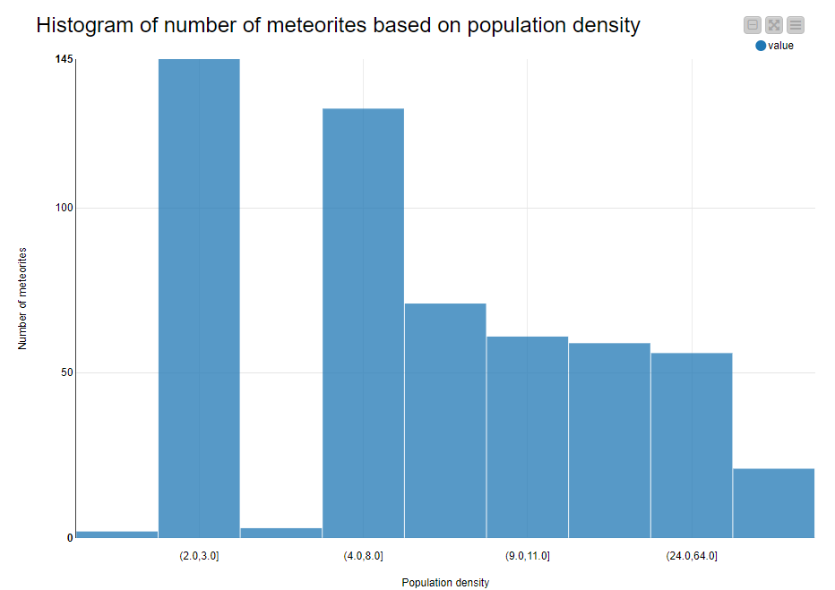

# Term Project 2

## Goal

1. Checking a connection between the number of meteorites and the population density

2. Another assumption is that more developed countries are better at spotting meteorites due to more spending on fancy equipment. Thus the relation between meteorites and GDP per capita is seen.

### Data

1. meteorite data as dataset:

    https://data.nasa.gov/Space-Science/Meteorite-Landings/gh4g-9sfh

2. data from worldbank with country and population data (including area and population to calculate pop density) as dataset 2: 

    http://api.worldbank.org/v2/country/usa/indicator/EN.POP.DNST?date=2010 

   (Using the year and the country to pull in population density with this API. This can be filtered for observations after 2000.)

3. GDP per capita for 2007 which is the average year of observations after 2000

    (the API of worldbank)

## Technical choices

### Meteorites and population density

The procedure afterwards was following: 
- Use random subset excluding any rows where the latitude value is smaller than -60 to exclude Antarctica as it has loads of meteorites but population is 0. 
- clean the data from missing values
- filter out some columns that are not needed
- convert the numerical values to strings (as the API needs a string input)
- use another geocoding API that has a capacity of 50k/month 
    -  API that can "decode" geodata with longitudes and latitudes to country name and merge the 2 datasets on country and year
    
        https://opencagedata.com/api 
- get the data in a JSON with the API
- do another string manipulation to use the country code output from API1 on a worldbank API
- use the worldbank API
- clean the data from missing values
- create a bar chart (The number of meteorites based on population density)

### Mereorites and GDP per capita 
- input GDP per capita to MySQL for 2007 from WorldBank data
- connect the GDP/capita data in knime
- connect GDP/capita and number of meteorites to create histogram
- clean country name in gdpcapita dataset
- query and Joined gdpcapita and meteorite dataset in Knime
- create a bar chart (AVG meteorite value by country)

## Data model (ER diagram for RDBMS)
(entity relation for RDBMS)
## Analytics and/or visualization

### The number of meteorites based on population density

### AVG meteorite value by country
