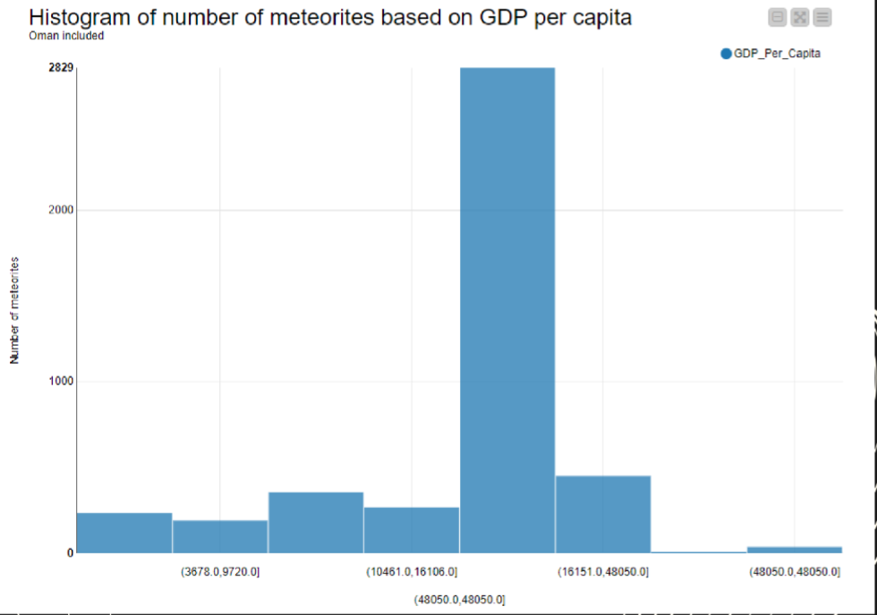
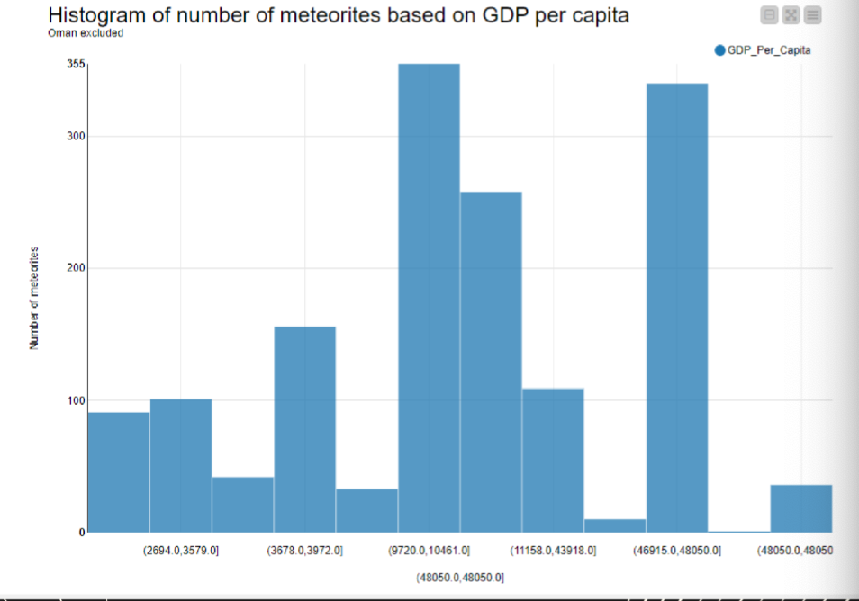
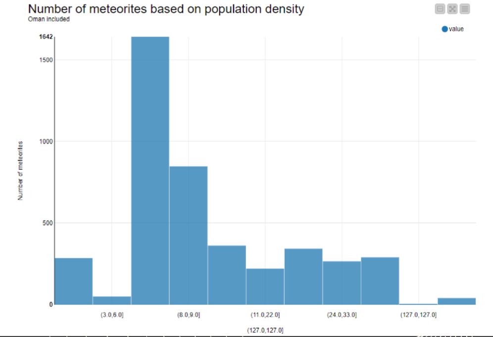
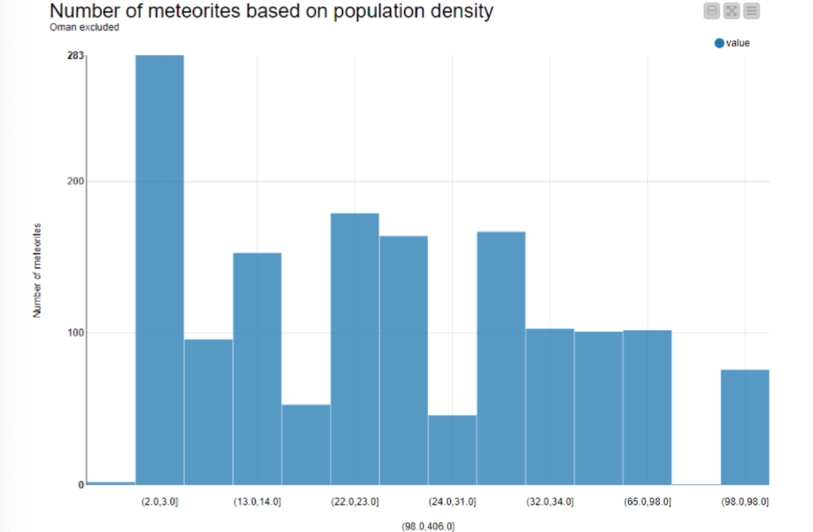

# Term Project 2　

(The brackets are the parts we have to revise)

## Background and goals

For our analysis we were inspired by a data visualisation created by Milan Janosov on meteorite landings (https://www.linkedin.com/posts/milan-janosov_30daymapchallenge-gis-datascience-activity-7125409941577695232-s4oi/?utm_source=share&utm_medium=member_desktop). His map shows where the different meteorites have landed and posits that there seem to be more meteorites in areas with higher population density. Our goal is to verify or deny this statement. We further check if a similar connection is existing between the countries' economic development and meteorite spottings - building on the assumption that richer countries have more budget to spend on scientific equipment that may help them in this endeavour. 

## Data

1. The dataset on meteorites is downloaded from the website of NASA and then loaded into SQL. The dataset contains more than 45 thousand observations. The table contains information (among others) on the id, name and mass of the meteorite, its size (measured in weight in grams), the year when it was found and the exact coordinates of its location in longitude and latitude. The exact structure of the table is visible on the EER diagram. There are no missing values in the table, however the location columns include 0 values. The data was loaded into MySQL.
 https://data.nasa.gov/Space-Science/Meteorite-Landings/gh4g-9sfh

2. For population density we are using the dataset of the World Bank which we access through an API (which we describe later) in the Knime workflow. This data includes the country name, the country code and the population density value.
3. For GDP per capita we are also using the World Bank database containing again country name, country code and the GDP per capita value in USD. This data was downloaded and also loaded into MySQL.
4. To connect the meteorite dataset and the country related data we will use the API of BigDataCloud to convert the coordinates to country codes and names. 
5. To visualize the meteorite landings on a world map, we shift to MongoDB to benefit from its JSON structure, uploading the full NASA dataset. After data cleaning through queries, we are able to exploit 38k observations. Transforming the dataset in GeoJSON, we use the mapping services of Mapbox.com to have a 3D rendering of the dataset. We also split the dataset into various time frames (upto 1800, 1800 to 1900,...) to visualize how the disoveries changed over time.

## Assumptions for the ETL and the analysis
Upon first inspection of the dataset we see that it contains a large number of observations in Antarctica. The GDP values and the population density values are likely to be extreme as well, and Antarctica is a huge scientific hub where we assume the meteorite spottings are incredibly overrrepresented compared to a country with a similar size, we will drop this continent from our analysis. We will do this by filtering out any observation where the latitude coordinates are smaller than -60.
Furthermore, we will focus on meteorites that have been observed in or after 2000. This will make the data density much higher, as older data points are more likely to have missing data for GDP per capita and/or population density. Furthermore, country borders are more likely to have changed as we go longer back in time, which the reverse geocoding API would not be able to reflect, therefore further skewing our dataset. After applying both filters, we have ~4500 observations left to analyse.
Lastly, to make the analysis somewhat simpler for the GDP per capita values we will use a singular year's results (which is 2007). 2007 is the average of the meteorite spotting years in the subset of our data with observations in or after 2000 only. This again is a simplification but we are less interested in the absolute figures of GPD per capita but rather their relative position. We assume that the year 2007 will be more or less similar to each observations respective year's data for both GDP per capita.

## The ETL workflow

We have created the ETL workflow using KNIME Analytics. Once the meteorite data and the GDP per capita data is loaded in MySQL, we connect to them in Knime. Once loaded we drop the unnecessary columns and filter the meteorite data of values where the longitude variable is 0 leaving only observations with valid location data in the table. We then combine the year, longitude and latitude variables to create the https format API for the reverse geocoding. The API calls have a delay of 100ms to ensure that they are not blocked. As we are using a free API, it has a limit of 50,000 calls per month. (At the point of submission there are more than 35,000 API calls still available for December 2023 which should be plenty enough.) The API is then called which returns us a JSON file. We then extract the country and country code data into the table. We drop values where the API was unable to find the necessary values and drop columns with unneded data. Then we create the next https API format for the World Bank API using the country code and the year. This API again returns a JSON from which we extract the necessary data for population density and input it into the table.
Paralel to this part of the workflow, we also read in the GPD per capita data from MySQL, we clear it of missing values and merge it with the other table with the enriched meteorite table. This results in a total of ~4300 observations. We then use this data table to create two histograms (where the y axis shows the number of meteorites, and the x axis is either population density or GDP per capita binned together) and check for correlations. 

## The results
Upon first inspection of the histograms we observed a strange extreme value both in the GDP per capita and population density. Upon inspecting the data table, we spot that there are a huge number of observations for one single country: Oman, mostly in the same year (2001). We have conducted a quick research to understand this phenomenon, and have found that the administration of Oman has created a program in 2001 that has a campaign like scientific program which includes the search for meteorites in the country. Its success is clearly visible in the data, as this country has more around 2500 observations from our table which is more than half of the table. As this program is clearly a unique thing, we have decided that it destroys our analysis and we need to drop Oman from the table. The newly created histograms show a mixed picture. To get a more quantitative feel on the connection between our variables, we created a correlation matrix, which tells us that there is a weak positive correlation between both meteorite numbers and population density (r = 0.1251) as well as between meteorite numbers and GDP per capita (r = 0.1391). This means that our initial assumptions seem to be true in this dataset.

## Limitations, conclusions
The analysis confirmed our initial idea on the connections between number of meteorites and (1) development of the country and (2) population density, however the histograms and the correlation matrices suggest a relatively weak connection. Upon doing further research we have found that there are a number of other factors that may strongly influence meteorite occurrence. One of such factors is vegetation: in areas of dense vegetaion (e.g. jungles) it is extremely hard to find meteorites. On the other hand, deserts are a prefect places to find them with very little coverage and a uniform color scheme of sand which tends to make it very easy to spot them. Furthermore, due to the uneven gravitation forces on Earth, larger meteorites are more frequent closer to the equator. These meteorites are also more likely to fall to many pieces upon entry to the atmosphere creating a huge number of small meteorites. Since our analysis was only focusing on the number of the meteorites, this effect may again distort the data and the findings of the analysis. A more detailed and scientific approach is needed to create a more comprehensive model on the matter which is well beyond the scope of this analysis.

## Running the workflow
The steps to run the whole ETL are the following:
1. Run the data dumping SQL script to load the meteorites and GDP per capita data into MySQL.
2. Open the Knime workflow and connect to MySQL in Node 1 (MySQL connector) with the correct user and password to the instance where the data was loaded into in step 1.
3. Run the workflow
   Please note that due to the large volume of the data and the monthly limit on the APIs, we have inputed and limiter in Node 3 which takes a random subset of 100 from the meteorites data. This way the whole workflow (especially the API calls run significantly faster and one can test if the workflow performs as intended. If it is necessary to run the workflow for the full dataset, one only needs to delete this part from the configuration of Node 3.)

## Data model (ER diagram for RDBMS)
(entity relation for RDBMS)

## Analytics and/or visualization (needs explananion of x, y axis, and some suggestions from results)

The following graphs shows the number of meteorites based on population density and GDP per capita. 

### The number of meteorites based on GDP per capita

### The number of meteorites based on GDP per capita excluding Oman

### The number of meteorites based on population density

### The number of meteorites based on population density excluding Oman

